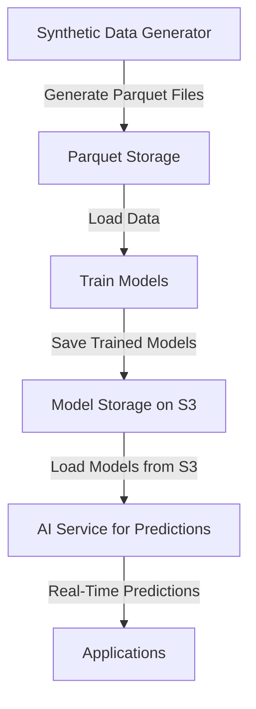

# 📊 **End-to-End Pipeline for Real-World Fraud Detection, Anomaly Detection, and Sensitivity Prediction** 📊

---

## **Overview**
This project pipeline uses **synthetic data generation**, **machine learning model training**, and **real-time predictions** for:
- **Fraud Detection**
- **Anomaly Detection**
- **Sensitivity Prediction** 

The pipeline consists of:
1. **Synthetic Data Generation** using `synthetic-data-generator`
2. **Model Training** using `train_models.py`
3. **Model Deployment** to **AWS S3** for scalability
4. **Real-Time Predictions** using `ai.service.ts`

---

## **Pipeline Architecture**



---

## **1. Synthetic Data Generation**
- **Script:** `synthetic-data-generator`
- **Description:** Generates synthetic data with labels for:
  - Anomalies
  - Fraud
  - Sensitivity

### **Directory Structure:**
```
scripts/
├── synthetic-data-generator/
│   ├── main.py                   # Main pipeline to generate all datasets
│   ├── anomaly_generator.py       # Anomaly data generation
│   ├── fraud_generator.py         # Fraud data generation
│   ├── sensitivity_generator.py   # Sensitivity data generation
│   ├── parquet_writer.py          # Save generated data to Parquet
│   └── phone_number_generator.py  # Phone number generation logic
```

### **Generated Output:**
```
src/
└── phone/
    └── resources/
        └── generated/
            ├── anomaly-data-large_batch_1.parquet
            ├── fraud-data-large_batch_1.parquet
            └── sensitivity-data-large_batch_1.parquet
```

### **How to Run:**
```bash
cd scripts/synthetic-data-generator
python3 main.py
```

---

## **2. Model Training**
- **Script:** `train_models.py`
- **Description:** Trains models using synthetic data for:
  - **Anomaly Detection**
  - **Fraud Detection**
  - **Sensitivity Prediction**

### **Features:**
- **Bidirectional LSTM** with **Attention Layer** for sequence learning
- **Dynamic Padding and Truncation** for varying phone number lengths
- **Advanced Callbacks** for early stopping and learning rate adjustment

### **Data Input:**
- **Parquet Files** generated from `synthetic-data-generator`

### **How to Run:**
```bash
cd scripts
python3 train-models.py
```

### **Output:**
Models saved in both **TensorFlow SavedModel** and **HDF5** formats:
```
src/
└── phone/
    └── models/
        ├── sensitivity-model/
        ├── anomaly-detection-model/
        └── fraud-detection-model/
```

---

## **3. Model Deployment to S3**
- **Script:** `upload-to-s3.ts`
- **Description:** Uploads trained models to **AWS S3** for scalability.

### **How to Run:**
```bash
cd scripts
npm run upload:models
```

### **Requirements:**
- AWS CLI configured with necessary IAM permissions.
- S3 bucket configured for model storage.

---

## **4. AI Service for Real-Time Predictions**
- **File:** `src/phone/services/ai.service.ts`
- **Description:** Loads models from S3 and provides predictions for:
  - **Sensitivity** (`predictSensitivity`)
  - **Anomaly Detection** (`detectAnomaly`)
  - **Fraud Detection** (`detectFraud`)

### **Architecture:**
- **TensorFlow.js** for model loading and predictions.
- **Integration with MaskingService** for dynamic masking based on predictions.
- **Multithreading** and **AI-Driven Masking** for scalability and performance.

---

## **5. Pipeline Maintenance**
### **Regular Updates:**
- **Weekly Data Updates:**
  - Update synthetic data using `synthetic-data-generator`.
  - Retrain models using `train-models.py`.
  - Deploy updated models to S3 using `upload-to-s3.ts`.

### **Version Control and CI/CD:**
- **Use Git** for version control.
- **CI/CD Pipeline** using GitHub Actions for:
  - Automatic data generation and model training on every update.
  - Continuous deployment to AWS S3.

---

## **6. To-Do: Real-World Integration**
- Integrate **real-world fraud patterns and spam reports** to improve model accuracy.
- Integrate with:
  - **Numverify**, **Truecaller**, and **Twilio Lookup** APIs for real-world data.
  - **Crowd-Sourced Databases** for spam and fraud numbers.

---

## **7. Tech Stack and Dependencies:**
- **Languages:** TypeScript (Node.js) and Python
- **Frameworks:** TensorFlow.js, TensorFlow, Keras, Sklearn
- **Cloud Services:** AWS S3 for model storage and deployment
- **APIs:** Numverify, Truecaller, Twilio Lookup

### **Install Dependencies:**
```bash
npm install
pip install -r requirements.txt
```

---

## **8. Future Enhancements:**
- **Anomaly Detection with Advanced Models**: Isolation Forest, Autoencoders, or Transformers.
- **Fraud Detection with Real-World Labels**.
- **Continuous Learning and Updating**: Implement AutoML for model optimization.

---

## **Need Help?**
For support, contact [Your Name] at [Your Email].
